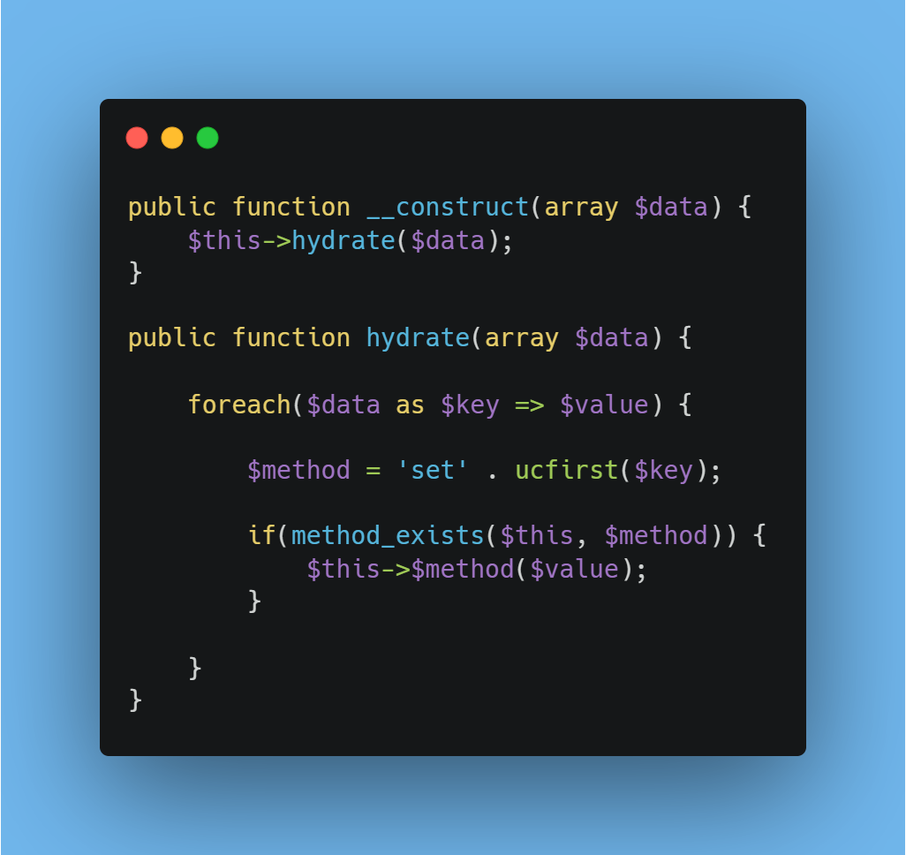

# Consigne: TP POO
Dans cet TP on fera un petit système de gestion de membre.

## Base de données

1. Créer une base de données `tp_poo` avec la table `membre` ayant les champs suivants:
    - id INT(3) Primary key auto_increment
    - nom VARCHAR(20)
    - prenom VARCHAR(20)
    - email VARCHAR(255)
    - tel VARCHAR(10) DEFAULT NULL

## User class

1. Créer une classe `User` qui aura les propriétés suivantes:
    - id
    - nom
    - prenom
    - email
    - tel

2. Créer les getters et setters pour les propriétés de la classe.

3. Cette classe aura un constructeur qui prendra en paramètre un tableau associatif avec les clés correspondant aux propriétés de la classe.(principe de l'hydratation)

Exemple: d'hydratation:

1. Créer 4 constantes de classe pour stocker les messages d'erreur sur les propriétés de la classe. Créer une propriété `errors` qui sera un tableau vide. Créer une méthode `getErrors` qui retournera le tableau `errors`.

2. Faire les contrôles suivants sur les propriétés de la classe:
    - id: doit être un entier
    - nom: doit être une chaîne de caractères
    - prenom: doit être une chaîne de caractères
    - email: doit être une chaîne de caractères et doit être un email valide
    - tel: doit être une chaîne de caractères

3. Créer une méthode `isValid` qui retournera un booléen en fonction de la validité des données de l'objet.

## Classe Database (pattern singleton)

1. Créer un fichier `Database.php` qui va gérer la connexion à la base de données. Cette classe aura une propriété statique `$pdoInstance` qui sera un objet PDO.
2. Cette classe aura un constructeur privé.
3. Cette classe aura une méthode statique `getPdo()` qui retournera l'objet PDO. Si l'objet PDO n'existe pas, on le crée et on le retourne. Sinon on le retourne directement. 

## User manager
Ce fichier va gérer le crud sur la table `membre`.

1. Créer une classe `UserManager` qui aura un constructeur qui prendra en paramètre un objet PDO.

2. Créer une méthode `insertUser` qui prendra en paramètre un objet `User` et qui insérera les données de l'objet dans la table `membre`.

3. Créer une méthode `getAllUsers` qui retournera un tableau d'objets `User` contenant tous les membres de la table `membre`.

4. Créer une méthode `getUserById` qui prendra en paramètre un entier et qui retournera un objet `User` correspondant à l'id passé en paramètre.

5. Créer une méthode `updateUser` qui prendra en paramètre un objet `User` et qui mettra à jour les données de l'objet dans la table `membre`.

6. Créer une méthode `deleteUser` qui prendra en paramètre un objet `User` et qui supprimera les données de l'objet dans la table `membre`.

## autoload

1. Créer un fichier `autoload.php` qui va gérer l'autoload des classes.

## inscription.php

1. Créer un fichier `inscription.php` qui va permettre d'insérer un membre dans la table `membre`.

2. Faire la connexion à la base de données.

3. instancier un objet `UserManager` avec l'objet PDO en paramètre.

4. Instancier un objet `User` avec un tableau associatif en paramètre au clic sur le bouton `submit`. Si les données sont valides, insérer le membre dans la table `membre` et afficher un message de succès. Sinon afficher les messages d'erreurs.

## admin.php

1. Créer un fichier `admin.php` qui va permettre de lister tous les membres de la table `membre` , de modifier un membre et de supprimer un membre.

2. Faire la connexion à la base de données.

3. instancier un objet `UserManager` avec l'objet PDO en paramètre.

4. Afficher tous les membres de la table `membre` dans un tableau HTML en utilisant la méthode `getAllUsers` de la classe `UserManager`.

5. Ajouter un lien pour modifier un membre et un lien pour supprimer un membre en utilisant la méthode `getUserById` de la classe `UserManager`.

6. Au clic sur le lien modifier, afficher un formulaire pré-rempli avec les données du membre à modifier

7. Au clic sur le lien supprimer, supprimer le membre de la table `membre` et afficher un message de succès.